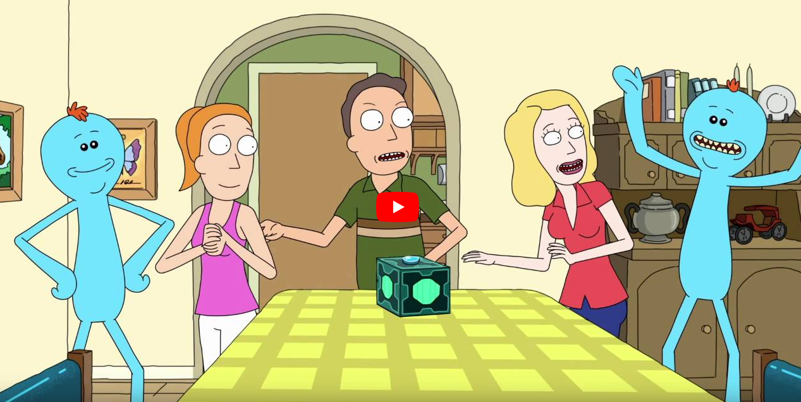
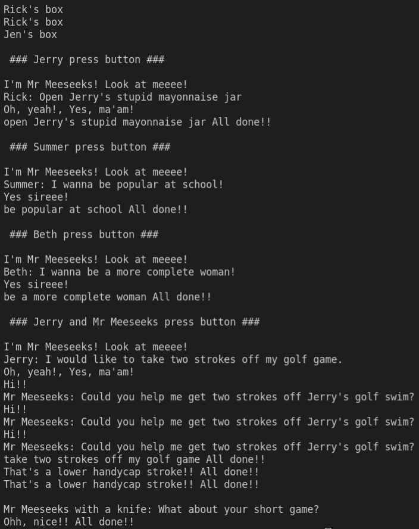
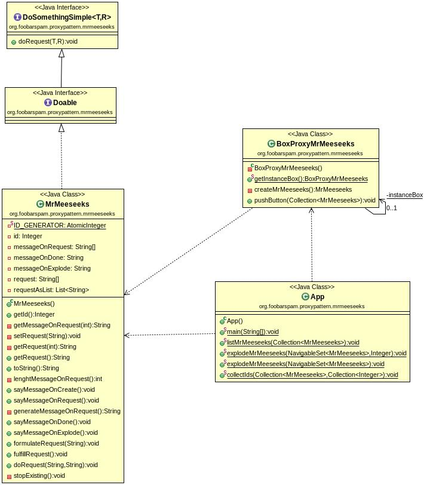

Proxy Pattern Mr Meeseeks
=========================

Jen, Jerry y Summer utilizar la caja de generación de Mr Meeseeks que Rick ha construido.

Implementa el proceso de creación, conversación, satisfacción del deseo y fin de la existencia de cada uno de los Mr Meeseeks que aparecen en la secuencia del vídeo (estas son las historias de usuario/a):

Puedes observar la salida de la aplicación en la figura:

## Implementación

Consulta el manual de referencia para ver un ejemplo del patrón de diseño estructural **Proxy**. Se trata de un patrón clásico para una app implementando la POO en Java, pero quizás puedas sacar partido de que JS es un lenguaje basado en prototipos, lo que simplifica bastante el diseño de la solución y codificació del comportamiento de los meeseeks.

PASA LOS CASOS TEST PROPUESTOS y utilízalos como guia para el desarrollo practicando TDD. No puedes modificar el código de los casos test.

El _script_ `./src/main.js` es el _script_ principal y ha de funcionar. No puedes modificar su código.

Crea un proyecto npm con dos paquetes **con los correspondientes casos test que se proporcionan**:
- Uno para la objeto `box` que se encarga de crear los meeseeks.
- Otro para el objeto `mrmeeseeks`.

Respeta la estructura del proyecto indicada en el nombre de los paquetes que se indican en los casos test.

- Realiza commits periódicamente mientras avanzas en el desarrollo de la aplicación.
- Publica tu solución en un repo en GitHub.
- Compártelo conmigo si es privado.
